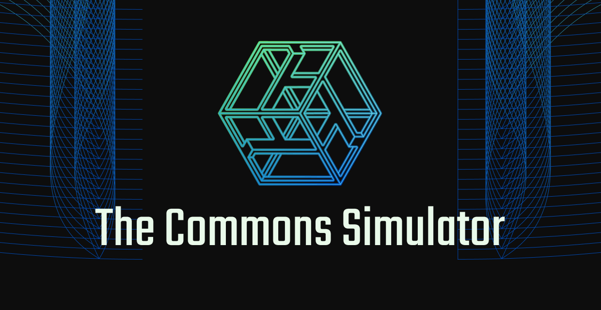

# Commons Simulator



The Commons Simulator is a community project funded entirely by Gitcoin Grants, and undertaken by the Commons Stack’s dDev team. The Commons Simulator blends art and simulation into a dystopian sci-fi future where you travel back in time with cadCAD, a complex systems simulator that can predict the future.


You use cadCAD to help the fledgling RadicalxChange movement to customize their Cyber-Physical Commons to suit the needs of their community and save the world from ecosystem collapse!

## Project Setup

```
npm install
```

### Compiles and hot-reloads for development

```
npm run serve
```

### Compiles and minifies for production

```
npm run build
```

### Lints and fixes files

```
npm run lint
```

## Deployment


[](https://app.netlify.com/sites/commons-stack-game-sim/deploys)

All commits to `master` branch are automatically deployed with Netlify.


## Resources

- [Play the game here!](https://sim.commonsstack.org/)
- [Medium Post](https://medium.com/commonsstack/the-commons-simulator-game-is-live-e1986615a105)
- [Gitcoin Grant](https://gitcoin.co/grants/277/commons-simulator-modeling-sustainable-funding-for)
- [Telegram Channel](https://t.me/CSDdev)
- [About the Commons Stack](https://commonsstack.org/)


